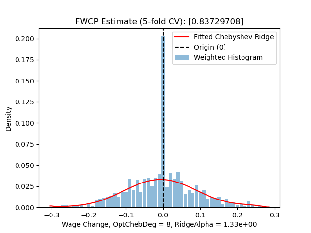
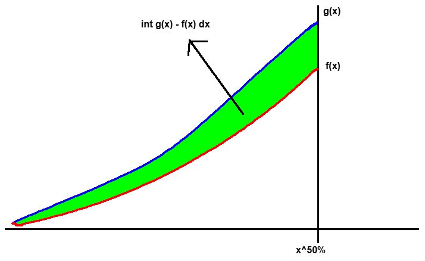
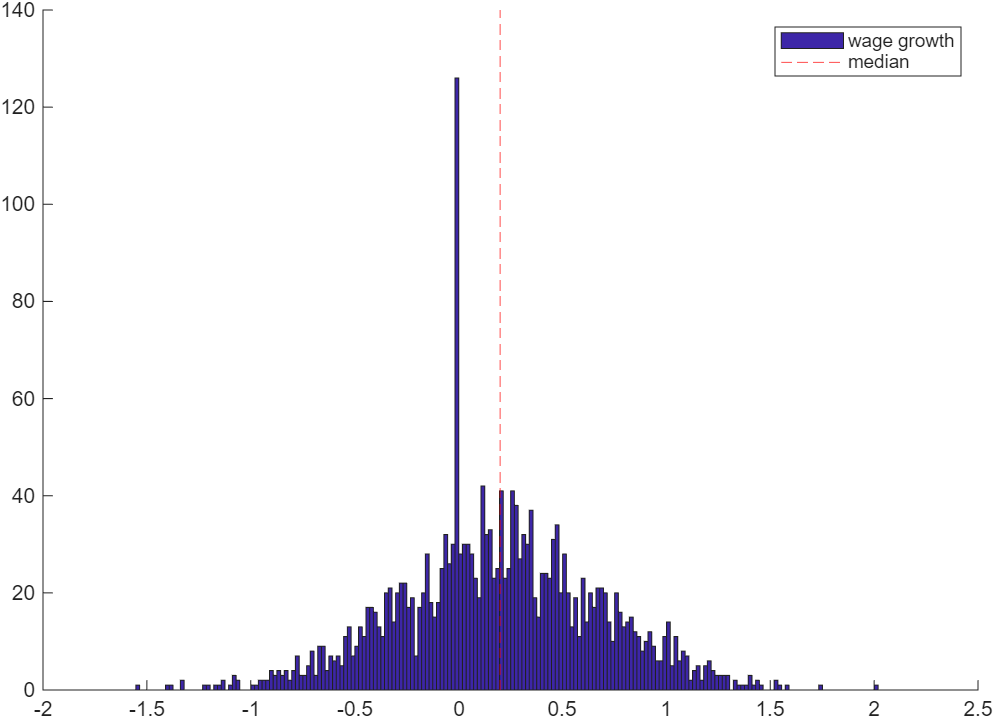



<!-- TOC start (generated with https://github.com/derlin/bitdowntoc) -->

- [1. Math](#1-math)
   * [1.1 Bunching FWCP estimator](#11-bunching-fwcp-estimator)
   * [1.2 Symmetry-based FWCP estimator](#12-symmetry-based-fwcp-estimator)
      + [1.2.1 Constructing notional distribution](#121-constructing-notional-distribution)
         - [1.2.1.a The Same sample](#121a-the-same-sample)
         - [1.2.1.b Holden & Wulfsberg (2009, JME)](#121b-holden-wulfsberg-2009-jme)
      + [1.2.2 Computing FWCP](#122-computing-fwcp)
   * [1.3 Practical notes](#13-practical-notes)
- [3. Programs with docs](#3-programs-with-docs)

<!-- TOC end -->

<!-- TOC -->
## 1. Math

Downward nominal wage rigidity (DNWR) is a nominal friction characterizing that nominal wage is harder to decrease than to increase due to some institutional and psychological reasons. It has been formalized into today's macroeconomic modeling via a series of research by Schmitt-Grohé and Uribe. Mathematically, it is an occasionally binding constraint (OBC) in form:
    
$$
w_{t} \geq \delta w_{t-1}
$$

where \(\delta\) tells the degree of DNWR (e.g. 0.99). In equilibrium, the OBC generates kinks in policy functions, which implies a mass spike at zero-growth point or in its neighborhood in the distribution of (individual job stayer's) nominal wage growth rates.

To empirically measure the intensity of DNWR, the literature compares actual wage growth distribution \(f(x)\) and a counterfactual/notional distribution \(g(x)\) where there is no DNWR preventing wage from going down. The **_fraction of wage cuts prevented (FWCP)_** computed from the comparison then becomes the empirical measure of DNWR.

Intuitively, the identification relies on what assumption(s) to use for constructing the notional distribution \(g(x)\). There are 2 main ideas:
    
1. **Symmetry assumption**: If there is no friction that prevents wage from dropping, then the wage growth rate should be symmetric about its median \(x^{50\%}\) or its mean \(\overline{x}\)[^1].
1. **Zero mass spike assumption**: If there does be friction that prevents wage from dropping, then the equilibrium-implied wage growth distribution shall have a mass spike in the neighborhood of 0 (as shown in the figure below). However, if friction-free, then the mass should be "smooth" across the neighborhood.

The two different assumptions lead to two kinds of estimators: symmetry-based FWCP estimator, and bunching FWCP estimator, respectively.

<!-- TOC -->
### 1.1 Bunching FWCP estimator

Bunching FWCP estimator is more popular today when micro wage growth data is well available.

**Procedures**:
    
1. Denote observed wage growth data as \(\{x_{i},w_{i}\}_i\) where \(i\) marks individual job stayers across two periods; \(x_{i}\) is wage growth rate; and \(w_{i}\) is (optional) weight provided in some questionnaire datasets.
1. Cut \(x_{i}\) into total \(K\) _fine_ bins (e.g. every 1% growth[^2]) while ensuring there exists a bin having 0 as its middle point[^3].
1. Count frequency \(\{q_k\}_{k\in K}\) of each bin, then estimate a weighted histogram \(\{x_k, d_k\}_{k\in K}\) where \(d_k\) is the _density_ at bin middle point \(x_k\) that represents the whole bin[^4].
1. Then, record the estimated density of the mass spiking bin that centers at 0. Let \(j\) be the index of the mass spiking bin, and denote its density as \(d_{j}\).
1. After that, fitting a polynomial regression on data \(\{x_k,d_k\}_{k\neq j}\) by removing the density point of the mass spiking bin. The estimated model \(\hat{g}(x)\) is then the notional distribution of wage growth.
    - Caution: polynomial regression is recommended because what we do is smoothing over the mass spiking bin as if it does not spike there.
    - Caution: stay with global polynomials such as Chebyshev. Because global polynomials cares about shape of the whole distribution while suppressing the possible numerical oscillations in neighboring bins. Local methods such as splines, Loess, kernel density (KDE) would totally depend on those neighboring bins because of being piecewise.
    - Caution: cross-validation (CV) is typically required. For linear polynomial regressions, leave-one-out (LOO) CV is more efficient than K-fold CV.
    - My implementation fits the notional distribution function using a Chebyshev-Ridge method i.e. Chebyshev polynomial regression with ridge regularization.
        - Why Chebyshev: standard and best choice if no special restrictions.
        - Why ridge regularization: cutting data into very fine bins often introduces high-frequency zig-zag to the histogram estimate. Ridge regularization can ideally suppressing the zig-zag's impact while keeping efficient computing.
        - Caution: when doing CV, one has to jointly select the maximum degree of Chebyshev polynomials and the ridge hyper-parameter to minimize e.g. RMSE.
1. Predict counterfactual density at 0. Denote the density as \(\tilde{d}_j = \hat{g}(0)\).
1. Define FWCP as \(y_{\text{bunch}} := 1 - \tilde{d}_j/d_j\) i.e. the fraction of excess mass at the mass spiking point.
    - Hint: a common truncation \(\max\{0,y_{\text{bunch}}\}\) happens because it is often thought that "friction cannot be negative".
    - Pros: the definition of \(y_{\text{bunch}}\) here bounds its value within \([0,1]\) as a ratio, which is comparable across datasets or subsamples.

Even though bunching FWCP estimator is popular today, one has to be very careful when using it:

1. The estimator requires large amount of micro wage data of individual job stayers, making it hard to construct at less aggregate level where micro data are less available.
1. The estimator is _local_ by focusing on the small mass spiking region, which is insensitive to things happening at tails or even a little bit further away from zero growth. This property makes the estimates often independent from many economic variables (so don't be surprised if you find almost zero correlationship).

<!-- TOC -->
### 1.2 Symmetry-based FWCP estimator

This kind of estimators were once popular in early studies and still important today. It is based on the more relaxed identification assumption above. 

The procedures is similar to bunching FWCP estimator: 1. construct notional distribution \(\hat{g}(x)\); 2. compute FWCP.

However, the implementation at each step is quite different.

<!-- TOC -->
#### 1.2.1 Constructing notional distribution

Based on the symmetry assumption, we construct notional distribution \(\hat{g}(x)\) by mirroring the actual distribution/density function against the median \(x^{50\%}\) (or mean, but mostly median). Specifically, "flipping" the right side of \(x^{50\%}\) to the left side:

Here, depending on what data are used to estimate \(\hat{g}(x)\), there are two kinds of constructions.

<!-- TOC -->
##### 1.2.1.a The Same sample

This is traditional: the data sample for estimating \(\hat{g}(x)\) is the same as the data sample to estimate FWCP on. In this case, the actual wage growth distribution \(f(x)\) for FWCP computing has an analytical relationship with \(\hat{g}(x)\). Writing the equation:
    
$$
\hat{g}(x) := \begin{cases}
f(x), x \geq x^{50\%} \\
f(2x^{50\%}-x), else
\end{cases}
$$

- Pros: simple and easy to apply
- Cons: 
    - the degree of DNWR would be underestimated when the whole distribution of wage growth is too "left" e.g. in a recession.
    - even in ordinary time, the median is not necessarily to be the threshold of DNWR being binding: even someone beyond the median could be binding to DNWR constraint. The subsample (right side of the median) to construct notional distribution cannot ensure to be rigidity-free.
    - thus, the relaxed assumption is less powerful than the mass spiking assumption to uniquely identify where DNWR constraint is binding.

<!-- TOC -->
##### 1.2.1.b Holden & Wulfsberg (2009, JME)

To improve the notional distribution construction by overcoming the cons in Section 1.2.1.a, Holden & Wulfsberg (2009, JME)[^5] proposes an alternative method by using a subsample \(\{z_i\}_i\) that are more likely to be rigidity-free. The subsample can be from \(f(x)\), the actual distribution for finally computing FWCP, and can also come from another dataset in case of need.

Consider a sample that can properly represent the whole wage growth distribution. HW09 picks top 25\% growth observations which are thought to be very likely to be rigidity free. Then, the subsample \(\{z_i\}_{i}\) is mirrored about its minimum to get a symmetric notional distribution \(\hat{g}(x|\mu_z,\sigma_z)\) with two parameters: location parameter \(\mu_z\) and dispersion parameter \(\sigma_z\). Here the subscript \(z\) indicates to which sample the parameters belong.

In practice, we choose \(\hat\mu_z = z^{50\%}\) the median as the location parameter; and choose \(\hat\sigma_z := z^{75\%} - z^{35\%}\) as the dispersion parameter. About the justification of why doing so, please check HW09 paper.

")

However, one can immediately realize that this notional distribution \(\hat{g}(x|\mu_z,\sigma_z)\), no matter which sample based on, is not comparable with any actual wage growth distribution \(f(x)\):
- If \(\{z_i\}\) is drawn from \(f(x)\), then the location parameter \(\mu_z\) is actuall the top 25\% quantile of \(f(x)\) rather than its median.
- If \(\{z_i\}\) is drawn from another population (e.g. auxiliary dataset(s)), then \(\mu_z\) is still likely to be much higher than median of \(f(x)\).

To accommodate \(\hat{g}\) with \(f\), HW09 normalizes the distribution to \(\hat{g}(x|0,1)\) by:

$$
\hat{g}(x|0,1) = \frac{x - \hat\mu_z}{\hat\sigma_z} = \frac{x - z^{50\%}}{z^{75\%} - z^{35\%}}
$$

Applying the normalization to every \(z_i\) in the underlying sample of \(\hat{g}(x|\mu_z,\sigma_z)\), we get a normalized notional sample \(\{z^{0,1}_i\}_i\) as if they are drawn from the normalized distribution \(\hat{g}(x|0,1)\).

Then, when we want to construct notional distribution for an actual wage growth distribution \(f(x|\mu_x,\sigma_x)\) with parameters \((\mu_x,\sigma_x)\), we simply re-scale  \(\{z^{0,1}_i\}_i\) to  \(\{z^{\mu_x,\sigma_x}_i\}_i\) using the paramters of the actual wage growth distribution \(f\) and get a corresponding counterfactual distribution \(\hat{g}(x|\mu_x,\sigma_x)\).

 works like canned foods for food trucks")

- Pros:
    - Build once, then use for many times. This method works pretty well in scenario that we have to estimate FWCP for many times (e.g. for every state in the US).
    - The reference dataset for drawing \(\{z_i\}_i\) is not necessary to be the actual wage growth data. This helps improve the quality of estimation by requiring very few degrees of freedom (only need 3 parameters: median and two quantiles) of \(\{x_i\}_i\), which is desirable when there is not enough observations to compute other data-heavy estimators such as the bunching FWCP estimator.
- Cons:

    - There is an underlying assumption: the reference data to draw \(\{z_i\}\) is supposed to have the same confounders with the actual data to draw \(\{x_i\}\). Otherwise, one may have to prove the independency, or controlling for those confounders using techniques like distributional regression and functional data analysis (FDA, <del>Food and Drug Administration</del>)

<!-- TOC -->
#### 1.2.2 Computing FWCP

When the notional distribution \(\hat{g}(x)\) is ready, it is time to really compute the value of FWCP.

**Definition 1: unweighted integration**

$$
\hat{y}_{sym}^{uw} := \int_{-\infty}^{x^{50\%}} \left( \hat{g}(x) - f(x)  \right)\text{d}x
$$

The above figure illustrates the intuition: the cummulative excess mass measures how much wage cuts are prevented by comparing two worlds with and without DNWR.

Although conceptually different, values computed by definition 1 is often positively correlated with the values by the bunching FWCP estimator. The two are numerically consistent.

**Definition 2: weighted integration**

$$
\hat{y}_{sym}^{wt} := \int_{-\infty}^{x^{50\%}} |x^{50\%} - x| \left( \hat{g}(x) - f(x)  \right)\text{d}x
$$

This weighted version of definition 1, in addition to measuring the extensive margin (quantity) of wage cuts prevented, also incorporates the intensive margin (degree). It is supposed to be more comprehensive but less used in practice, as it is often hard to remove the impact of business cycle when checking the degree of DNWR across time.

**Definition 3: frequency**

$$
\hat{y}_{sym}^{fr} := 1 - \frac{\#\{z^{\mu_x,\sigma_x}_i < 0\} / \#\{z^{\mu_x,\sigma_x}_i\}}{\#\{x_i < 0\} / \#\{x_i\}}
$$

This formula applies to HW09 and other scenarios where one may want to respect the data as possible as they can. It does not require density estimation so that it is independent from hyperparameters (e.g. bandwidth selection, degree-ridge joint selection).

**Definition 4: rule-of-thumb**

$$
\hat{y}_{sym}^{rt} := \Pr\{x > 0\} - \Pr\{x < 0\} = 1 - 2\cdot q(0)
$$

where \(q(0)\) is the quantile of 0 in the actual wage growth distribution \(f\). This rule-of-thumb formula in fact puts a stronger assumption: the notional wage growth distribution is symmetric and symmetric about 0.

<!-- TOC -->
### 1.3 Practical notes

1. The bunching FWCP estimator is often more robust than symmetry-based FWCP estimators due to its strong locality. However, it is still sensitive to the bin-width/bandwidth selection. In the above sections, I recommended 1\% for consistence with canonical parameter value \(\delta=0.99\) in theoretical models. However, my own practice would suggest 2\% for a better trade-off between numerical stability and economic interpretation.
2. Integration-based symmetry-based FWCP estimators are sensitive to outliers. Be sure to well clean your data. e.g. winsorizing \(\{x_i\}\) to \([-100\%,+200\%]\) if using percentage growth. If using log growth, then \((-700\%,+200\%]\) is wide enough.
2. In real data, mass spike and asymmetry may simultaneously exist in one actual wage growth distribution (as illustrated in the below figure)[^6] if the economy has a positive wage growth trend. In this case, symmetry-based estimators, esp. integration-based FWCP definitions, could greatly underestimate the degree of DNWR because of the excessive mass at the mass spiking region. To fix this issue, one should remove those spiking-region observations before fitting \(f\) and \(\hat{g}\). This processing is similar to what one does in computing the bunching FWCP estimator.

<!-- TOC -->
## 3. Programs with docs

- Python (unified version, recommended)
    - [fwcp.py](fwcp.py)
    - [test.py](test.py)
    - [demo.ipynb](demo.ipynb): Usage examples and illustration
    - [compare.ipynb](compare.ipynb): Comparison between estimators
- Python (legacy programs, for archive only)
    - [fwcp_bunch_and_symmetric.py](legacy_code/fwcp_bunch_and_symmetric.py): Bunching FWCP estimator, and standard symmetry-based FWCP estimator in the literature
    - [fwcp_hw2009.py](legacy_code/fwcp_hw2009.py): Symmetry-based FWCP estimator in Holden and Wulfsberg (2009, JME)
    - [fwcp_legacy_bunch.py](legacy_code/fwcp_legacy_bunch.py): Legacy code for bunching FWCP estimator

[^1]: In practice, the median is more preferred and supported by data observations, as the mass "peak" often locates at median than mean.
[^2]: The bin width should be consistent to your theoretical \(\delta\) parameter in structural models.
[^3]: Or another point where the mass spike is supposed to happen according to your identification assumption. WLOG, I keep using 0 in this post.
[^4]: Representing a bin with its middle point is valid here because of the very fine bin width.
[^5]: Holden, S. and Wulfsberg, F. (2009). How strong is the macroeconomic case for downward real wage rigidity?. _Journal of Monetary Economics_, 56(4):605–615.
[^6]: Also see figures in: Dickens, W. T., Goette, L., Groshen, E. L., Holden, S., Messina, J., Schweitzer, M. E., ... & Ward, M. E. (2007). How wages change: micro evidence from the International Wage Flexibility Project. _Journal of Economic Perspectives_, 21(2), 195-214.