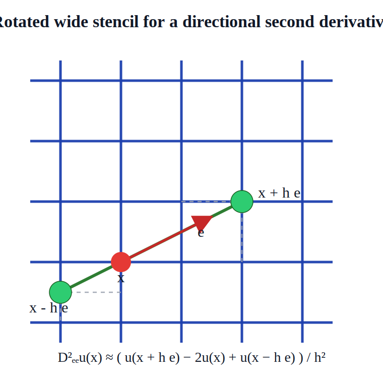



> Notations are arranged in [another post](../006_standardnotationforhjb/).

## 1. Background

### 1.1 Monotonicity of Barles–Souganidis (1991) theorem 

Barles–Souganidis (1991)[^2] theorem gives sufficient conditions for local convergence of a numerical scheme in which monotonicity, which respects reservation law of the PDE problem, is often the center of scheme design.

Consider non-linear 2nd-order PDEs, finite difference (FD), and Euler schemes. Let \(v^{t}_{\mathbf{i}} = v^{t}(x_\mathbf{i})\) be function value evaluated at grid point \(x_\mathbf{i} \in \hat{\mathcal{X}}\). Then, a numerical scheme at node \(\mathbf{i}\) is an equation about all on-grid function values:

$$
F\left( v^{t+1}_{\mathbf{i}} ; \left\{ v^{t+1}_{\mathbf{j}}  \right\}_{\mathbf{j}\neq\mathbf{i}} ; \left\{ v^{t}_{\mathbf{j}}  \right\}_{\mathbf{j}}  \right) = 0
$$

where I hide the dependence on \(t,x_{\mathbf{i}}\) etc.

WLOG, let's consider the following linear scheme[^1]:

$$
F(\dots) = \alpha^{t+1}_{\mathbf{i}} \cdot v^{t+1}_{\mathbf{i}} + \sum_{\mathbf{j}\neq \mathbf{i}} \beta^{t+1}_{\mathbf{j}} \cdot v^{t+1}_{\mathbf{j}} + \sum_{\mathbf{j}} \gamma^{t}_{\mathbf{j}} \cdot v^{t}_{\mathbf{j}} = 0
$$

where the coefficients \(\theta_{\mathbf{i}} := \left(\alpha^{t+1}_{\mathbf{i}}, \left\{ \beta^{t+1}_{\mathbf{j}} \right\}_{\mathbf{j}\neq \mathbf{i}} , \left\{ \gamma^{t}_{\mathbf{j}} \right\}_{\mathbf{j}}  \right)\) can be real-valued functions.

In the setup, the monotonicity requires that for all \(\mathbf{i}\), either:

- \(\alpha^{t+1}_{\mathbf{i}} < 0\)
- \(\beta^{t+1}_{\mathbf{j}} \geq 0\) for all \(\mathbf{j}\neq \mathbf{i}\)
- \(\gamma^{t}_{\mathbf{j}} \geq 0\) for all \(\mathbf{j}\)

or 

- \(\alpha^{t+1}_{\mathbf{i}} > 0\)
- \(\beta^{t+1}_{\mathbf{j}} \leq 0\) for all \(\mathbf{j}\neq \mathbf{i}\)
- \(\gamma^{t}_{\mathbf{j}} \leq 0\) for all \(\mathbf{j}\)

depending on how the terms are organized. I prefer the **1st** type so let's keep using it.

### 1.2 Unconditional monotone stencil with upwinding

Let's consider anisotropic uniform grid defined in the post of notations.

Consider implicit (Euler backward) linear scheme where  \(\gamma^t_\mathbf{j}=0\). When approximating derivatives with FD, one use \(v^{t+1}_{\mathbf{j}}\) rather than \(v^{t}_{\mathbf{j}}\). In this case, some special strategies like upwinding is considered. For example, for \(k = 1,\dots,n\), and at an interior node of index \(\mathbf{i}\)

we use a 3-point stencil combining forward and backward difference to approximate a linear term of the 1st-order derivatives:

$$
\begin{aligned}
\eta \cdot \frac{\partial v}{\partial x[k]}(x_{\mathbf{i}}) \approx& \left[ \eta \right]^{+} \cdot \frac{ v^{t+1}_{\mathbf{i}+\Delta x[k]\cdot \iota_k} - v^{t+1}_{\mathbf{i}} }{\Delta x[k]} + \left[ \eta \right]^{-} \cdot \frac{ v^{t+1}_{\mathbf{i}}  - v^{t+1}_{\mathbf{i}-\Delta x[k]\cdot \iota_k} }{\Delta x[k]} \\
=& \frac{1}{\Delta x[k]} \underbrace{ \begin{bmatrix}
	-\left[ \eta \right]^{-} &
	-\left[ \eta \right]^{+} + \left[ \eta \right]^{-} &
	\left[ \eta \right]^{+}
\end{bmatrix}  }_{\text{stencil}} \begin{bmatrix}
	v^{t+1}_{\mathbf{i}-\Delta x[k]\cdot \iota_k} \\
	v^{t+1}_{\mathbf{i}} \\
	v^{t+1}_{\mathbf{i}+\Delta x[k]\cdot \iota_k}
\end{bmatrix} 
\end{aligned}
$$

where \(\eta \in \mathbb{R}\) is coefficient[^3].

And, use a 3-point stencil of central difference to approximate a non-negative-coefficient term of the 2nd-order derivatives:

$$
\begin{aligned}
\eta \cdot \frac{\partial^2 v}{\partial x[k]^2}(x_{\mathbf{i}}) \approx& \frac{\eta}{\Delta x[k]^2} \left( v^{t+1}_{\mathbf{i}+\Delta x[k]\cdot \iota_k} - 2 v^{t+1}_{\mathbf{i}} + v^{t+1}_{\mathbf{i}-\Delta x[k]\cdot \iota_k}   \right)  \\
=& \frac{\eta}{\Delta x[k]^2} \underbrace{ \begin{bmatrix}
	1 & -2 & 1
\end{bmatrix}  }_{\text{stencil}} \begin{bmatrix}
	v^{t+1}_{\mathbf{i}-\Delta x[k]\cdot \iota_k} \\
	v^{t+1}_{\mathbf{i}} \\
	v^{t+1}_{\mathbf{i}+\Delta x[k]\cdot \iota_k}
\end{bmatrix} 
\end{aligned}
$$

where \(\eta \geq 0\) is coefficient.

In all the above examples, their monotonicity depends on the element signs of stencils. One can instantly realize that the above FD approximations are unconditionally monotone regardless the value of coefficient \(\eta\).

Unconditional monotone stencils are free of CFL condition, which allows larger time propagation step and faster convergence. If possible, one should consider unconditional monotone stencils.

### 1.3 Directional derivatives

Let \(\vec z \in \mathbb{R}^{n}\) be a _direction_ of unit length where \(\vec z = (z^1,\dots,z^n)\) and \(\sum_{i=1}^n (z^i)^2 = 1\). The derivatives of \(v\) along direction \(\vec z\) is defined as

$$
\frac{\partial v}{\partial \vec z}(x) = \lim_{h\to 0} \frac{ v(x + h\cdot \vec z) - v(x) }{h}
$$

Then,

$$
\frac{\partial v}{\partial \vec z}(x) = \sum_{i=1}^n z^i \frac{\partial v}{\partial x[i]} = \left< \vec z, \text{D}_x v(x) \right>
$$

For the 2nd-order directional derivatives,

$$
\frac{\partial^2 v}{\partial \vec z^2}(x) = \vec{z}^T \cdot \text{D}^2_x v(x) \cdot \vec{z} = \sum_{i=1}^n\sum_{j=1}^n z^i z^j \frac{\partial^2 v}{\partial x[i] \partial x[j]}(x)
$$

which is a quadratic form; and \(\text{D}^2_x v(x)\) is the Hessian evaluated at \(x\).

### 1.4 Risk adjustment term in HJB equation

Consider an HJB equation with discounting in typical form (ignoring the dependence of \(u,\mu,\sigma\) for readability):

$$
\rho v(x) = u + \underbrace{  \left< \mu, \text{D}_x v(x) \right> + \underbrace{ \frac{1}{2} \text{tr}\left\{ \sigma \cdot \sigma^T \cdot \text{D}^2_x v(x)  \right\} }_{\text{risk adjustment}, =: \mathcal{R}[v](x)}  }_{\mathcal{L}_x[v](x)}
$$

with underlying state process

$$
\text{d}x = \mu \cdot \text{d} t + \sigma \cdot \text{d}W
$$

where \(\mu \in \mathbb{R}^{n}\) is drift; \(W \in L^2_\mathcal{F}(0,\infty;\mathbb{R}^{m})\) is an \(m\)-dimension Brownian motion; \(\sigma\in \mathbb{R}^{m\times n}\) is diffusion/volatility matrix.

The risk adjustment term \(\mathcal{R}[v](x)\) represents how uncertainty changes the value function. In many applications, by construction, the underlying \(n\times n\) matrix \(\sigma \cdot \sigma^T \cdot \text{D}^2_x v(x)\) is diagonal so that \(\mathcal{R}[v](x)\) becomes a linear combination of the 2nd order derivatives \(\partial^2 v/\partial x[i]^2\), i.e. the on-diagonal elements of the Hessian \(\text{D}^2_x v(x)\).

However, less macroeconomic studies discuss the case when off-diagonal elements of the underlying matrix is non-zero, which involves the 2nd-order _mixed_ derivatives

$$
\frac{\partial^2 v}{\partial x[i] \partial x[j]}(x)
$$

The question is why?

<!-- ------- -->

## 2. Non-monotone stencil issue for the 2nd-order mixed derivatives

One main reason of avoiding the 2nd-order mixed derivatives is that: there is no simple unconditional monotone stencil for discretizing \(\frac{\partial^2 v}{\partial x[i] \partial x[j]}(x)\). The methods to fix this issue often require much extra efforts.

One can mathematically prove that, there does not exist a simple stencil, which uses neighbor nodes along the coordinate directions \(\{\iota_i\}_{i=1}^n\), approximating the 2nd-order mixed derivatives while being unconditionally monotone.

Among the issue-fix methods, _wide stencil_ method is kind of standard in literature that transforms the mixed derivatives to directional derivatives.

<!-- ----------- -->
## 3. Lemmas

**Lemma 1**

$$
\text{tr}\left\{ \sigma \cdot \sigma^T \cdot \text{D}^2_x v(x) \right\} = \text{tr}\left\{ \sigma^T \cdot \text{D}^2_x v(x) \cdot \sigma \right\}
$$

even though the shape of the trace's underlying matrices are different. This lemma is kind of trivial.

**Lemma 2**

Split \(\sigma\) into \(m\) column \(n\)-vectors:

$$
\sigma = \left[ \sigma^{(1)}, \dots, \sigma^{(m)}  \right]
$$

where \(\sigma^{(\ell)} \in \mathbb{R}^{n}\) for \(\ell = 1,\dots, m\). Then,

$$
\begin{aligned}
& \text{tr}\left\{ \sigma^{(\ell)} \cdot (\sigma^{(\ell)})^T \cdot \text{D}^2_x v(x) \right\}  = (\sigma^{(\ell)})^T \cdot \text{D}^2_x v(x) \cdot \sigma^{(\ell)}  \\
& = \sum_{i=1}^n \sum_{i=1}^n \sigma^{(\ell)}[i] \cdot \sigma^{(\ell)}[j] \cdot \frac{\partial^2 v}{\partial x[i] \partial x[j]}(x)
\end{aligned}
$$

which is a quadratic form.

**Lemma 3**

The \(n\times n\) covariance matrix \(\sigma\sigma^T\) can be decomposed to:

$$
\sigma\cdot \sigma^T = \sum_{\ell = 1}^m \sigma^{(\ell)} \cdot (\sigma^{(\ell)})^T
$$

**Lemma 4**

Assume \(v\) is \(C^2\) and Hessian is symmetric. A quadratic form of the \(\ell\)-th column \(\sigma^{(\ell)}\) and Hessian \(\text{D}^2_x v(x)\) is equivalent to the 2nd-order directional derivatives along direction \(\frac{\sigma^{(\ell)}}{\|\sigma^{(\ell)}\|}\).

**Proof 1**

Expanding the LHS and collect all terms:

$$
\begin{aligned}
& (\sigma^{(\ell)})^T \cdot ( D^2v \cdot \sigma^{(\ell)} ) = \sum_{i=1}^k\sum_{j=1}^k \sigma_i^{(\ell)} \cdot \sigma_j^{(\ell)} \cdot \frac{\partial^2 v}{\partial x_i \partial x_j}
\end{aligned}
$$

Expanding the RHS and collect all terms:

$$
\begin{aligned}
& \partial_{\sigma^{(\ell)}} v := \nabla v \cdot \sigma^{(\ell)} = \sum_{i=1}^k \frac{\partial v}{\partial x_i} \cdot \sigma^{(\ell)}_i
\end{aligned}
$$

then,

$$
\begin{aligned}
& \partial^2_{\sigma^{(\ell)}, \sigma^{(\ell)}} v := \partial\left( \sum_{i=1}^k \frac{\partial v}{\partial x_i} \sigma^{(\ell)}_i  \right)
\end{aligned}
$$

since operator \(\partial\) is linear:

$$
\begin{aligned}
& \partial^2_{\sigma^{(\ell)}, \sigma^{(\ell)}} v = \sum_{i=1}^k \sigma^{(\ell)}_i \cdot \partial_{\sigma^{(\ell)}} \left(\frac{\partial v}{\partial x_i}\right)
\end{aligned}
$$

Now, apply the directional derivative formula \((\nabla (\cdot) \cdot \sigma^{(\ell)}) \) to the partial derivative \(\partial v/\partial x_i\)

$$
\partial_{\sigma^{(\ell)}} \left(\frac{\partial v}{\partial x_i}\right) = \sum_{j=1}^k \frac{\partial}{\partial x_j}\left(\frac{\partial v}{\partial x_i}\right) \cdot \sigma^{(\ell)}_j = \sum_{j=1}^k \frac{\partial^2 v}{\partial x_i \partial x_j}\cdot \sigma^{(\ell)}_j
$$

Substituting it back into the sum, and get 

$$
\partial^2_{\sigma^{(\ell)}, \sigma^{(\ell)}} v = \sum_{i=1}^k \sum_{j=1}^k \frac{\partial^2 v}{\partial x_i \partial x_j}\cdot \sigma^{(\ell)}_j
$$

which is the same as the expansion of the LHS.

**Proof 2** 

Define an auxiliary function \(g(t) := v(x + t\cdot \sigma^{(\ell)})\). First derivative:

$$
\begin{aligned}
g'(t) = \nabla v(x+t\sigma^{(\ell)}) \cdot \sigma^{(\ell)} \\
g'(0) = \nabla v(x) \cdot \sigma^{(\ell)} = \partial_{\sigma^{(\ell)}} v
\end{aligned}
$$

Now take the derivative of \(g'(t)\) wrt \(t\). Apply the chain rule again to \(\nabla v(x+t\sigma^{(\ell)})\)

$$
\begin{aligned}
g{''}(t) = \frac{\text{d}}{\text{d} t} (\nabla v(x +t\sigma^{(\ell)}) \cdot \sigma^{(\ell)} ) \\
= \left( \frac{\text{d}}{\text{d} t} (\nabla v(x +t\sigma^{(\ell)})  \right) \cdot \sigma^{(\ell)} 
\end{aligned}
$$

The term \(\frac{\text{d}}{\text{d} t} (\nabla v(x +t\sigma^{(\ell)})\) is the Jacobian of the gradient (i.e. Hessian) multiplied by the inner derivative \(\sigma^{(\ell)}\)

$$
 \frac{\text{d}}{\text{d} t} (\nabla v(x +t\sigma^{(\ell)}) = ( D^2 v(x + t \sigma^{(\ell)}) ) \cdot \sigma^{(\ell)}
$$

Substituting it back:

$$
\begin{aligned}
& g''(t) = ( ( D^2 v(x + t\sigma^{(\ell)}) ) \cdot \sigma^{(\ell)} )\cdot \sigma^{(\ell)} \\
&= (\sigma^{(\ell)})^T \cdot D^2 v(x+t\sigma^{(\ell)}) \cdot \sigma^{(\ell)} 
\end{aligned}
$$

Evaluating it at \(t=0\):

$$
g''(0) =  (\sigma^{(\ell)})^T \cdot D^2 v(x) \cdot \sigma^{(\ell)} 
$$

Since \(g''(0)\) represents the second derivative along the line defined by \(\sigma^{(\ell)}\) which is exactly \(\partial^2_{\sigma^{(\ell)},\sigma^{(\ell)}}v\), the equality holds. The term \((\sigma^{(\ell)})^T \cdot D^2 v \cdot \sigma^{(\ell)}\) represents the curvature of the function \(v\) at point \(x\) in the direction of \(\sigma\).

<!-- ---------- -->
## 4. Wide stencil

So far, we have found that the risk adjustment term can be viewed as rotating the Hessian to specific directions defined by the covariance matrix, where the covariance matrix here serves as the rotation matrix.

A wide stencil is then naturally introduced: the points for computing finite difference by moving along direction \(\frac{\sigma^{(\ell)}}{\|\sigma^{(\ell)}\|}\) are not necessary to be coordinate neighbor points of \(v_{\mathbf{i}}\). As illustrated in the following figure, the implied stencil is "wider" than the stencils for computing the original 2nd-order mixed derivatives.

But wait a second, one may instantly realize that: <u>not every move-to node points are exactly on the current (uniform) grid.</u> What to do with the situation?

The answer is finding the nearest on-grid direction rather than using the exact direction \(\frac{\sigma^{(\ell)}}{\|\sigma^{(\ell)}\|}\). Specifically,

1. The point along the exact direction does not necessarily arrive at a grid point.
2. What we can do is to find a nearest on-grid direction to approximate the true directional derivatives. Easy to show that such approximation is consistent as grid steps go to zero.
3. It is not surprise to see that the one-step away grid point along direction \(\sigma\) is not necessary to be a neighbor grid point of the current grid point but can be further. A stencil using such points are still wide.

Let's see an example.

For every direction \(\sigma^{(\ell)}\), now let's find its nearest on-grid direction that points at a grid point. Consider an even-space grid where each grid point, where \(\Delta x[i]\) is the grid step along dimension \(i\). The notation of multi-index \(\mathbf{j}\) is the same as the other notes.

$$
\begin{aligned}
x_{\mathbf{j}} = [ \underline{x_1} + j_1 \Delta_{x_1}, \dots , \underline{x_k} + j_k\Delta _{x_n}   ]^T \\
\Delta_x = [\Delta_{x_1},\dots,\Delta_{x_n}]^T
\end{aligned}
$$

Now, assume _for now_ that all stencils below only need interior grid points in order to avoid discussing boundary conditions. Consider a direction \(\sigma^\ell\) 

$$
\sigma^\ell = [ \sigma^\ell_1, \dots, \sigma^\ell_n ]^T
$$

The directional derivatives, using 3-point monotone stencil, by definition,

$$
\partial^2_{\sigma^\ell\sigma^\ell} v \approx \frac{1}{\left|| \sigma^\ell \right||^2}\left( v[\mathbf{j}+\sigma^\ell] - 2v[\mathbf{j}] + v[\mathbf{j}-\sigma^\ell]   \right)
$$

where \(\left||\sigma^\ell\right||\) is the norm of direction vector \(\sigma^\ell\), and \(\mathbf{j}\pm\sigma^\ell\) is the deviation along direction \(\sigma^\ell\) for one step from the current grid point of index \(\mathbf{j}\).

Our demand is to make the directional neighbor points \(v[\mathbf{j}\pm\sigma^\ell]\) locate exactly on the current grid.

To do this, we consider an integer vector \(p^\ell = [p^\ell_1,\dots,p^\ell_k]^T\) such that

$$
\begin{aligned}
& p^\ell = \arg\min_p \left|| \hat\sigma^\ell  -  \sigma^\ell   \right|| \\
& \hat\sigma^\ell := p\odot \Delta_x
\end{aligned}
$$

such that \(\hat\sigma^\ell\) is the on-grid direction that is closest to the true/original direction \(\sigma^\ell\). The integer vector \(p^\ell\) can be used to move on grid.

The final stencil & approximation is:

$$
\frac{1}{\left|| \hat\sigma^\ell  \right||^2} \begin{bmatrix}
	1 & -2 & 1
\end{bmatrix} \cdot \begin{bmatrix}
	v[\mathbf{j} + p^\ell] \\
	v[\mathbf{j}] \\
	v[\mathbf{j} - p^\ell] \\
\end{bmatrix}
$$

<!-- FOOTNOTES -->

[^1]: Non-linear schemes work in similar way by checking \(F\)'s monotonicity (derivatives) against the on-grid function values. However, it is less used in practice so we focus on linear scheme here.

[^2]: Barles and P. E. Souganidis. Convergence of approximation schemes for fully nonlinear second order equations. *Asymptotic analysis*, 4(3):271–. 283, 1991.

[^3]: Coefficients \(\eta\) are different from \(\alpha,\beta,\gamma\) in the above formulation of linear stencil. The latter are obtained by collecting all linear term's \(\eta\)-like coefficients.

